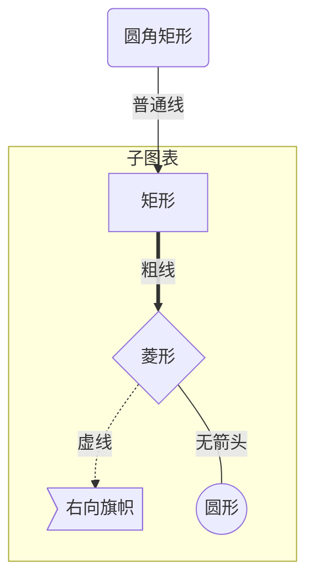
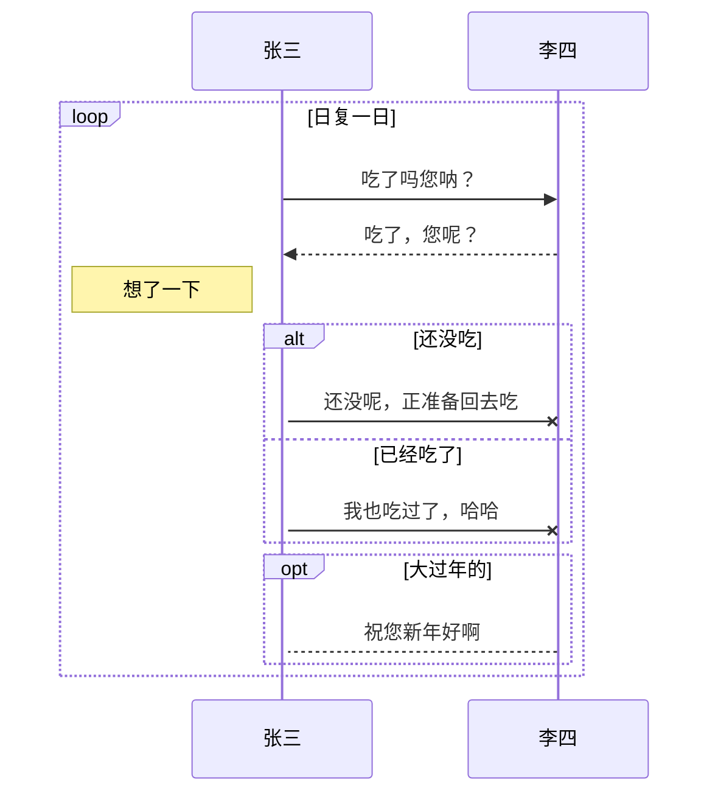

   # Mermaid  使用方法（此篇主要借鉴网络）

##  图形类型

- [流程图](#流程图语法)
- [序列图](#序列图)

## 流程图语法

## 定义节点

|     表述     |     说明     |
| :----------: | :----------: |
|  `id[文字]`  |   矩形节点   |
|  `id(文字)`  | 圆角矩形节点 |
| `id((文字))` |   圆形节点   |
|  `id>文字]`  |  旗帜状节点  |
|  `id{文字}`  |   菱形节点   |

## 定义连线

|    表述    |      说明      |
| :--------: | :------------: |
|    `>`     |  添加尾部箭头  |
|    `-`     | 不添加尾部箭头 |
|    `--`    |      单线      |
| `--text--` |  单线上加文字  |
|    `==`    |      粗线      |
| `==text==` |   粗线加文字   |
|   `-.-`    |      虚线      |
| `-.text.-` |   虚线加文字   |

Mermaid 支持多种图表的方向，语法如下：

```
graph 方向描述
    图表中的其他语句...
```

| 用词 |     含义 |
| ---- | -------: |
| TB   | 从上到下 |
| BT   | 从下到上 |
| RL   | 从右到左 |
| LR   | 从左到右 |


### 子图表

使用以下语法添加子图表

```
subgraph 子图表名称
    子图表中的描述语句...
end
```

## 例子




#序列图

使用以下语法开始序列图

```
sequenceDiagram
    [参与者1][消息线][参与者2]:消息体
    ...
```

例如

```
sequenceDiagram
    张三->>李四: 吃了吗？
    李四->>张三: 吃了
```

### 参与者

上例中的张三、李四都是参与者，上例中的语法是最简单的，也可以明显表明参与者有哪些

```
sequenceDiagram
    participant 参与者 1
    participant 参与者 2
    ...
    participant 简称 as 参与者 3 #该语法可以在接下来的描述中使用简称来代替参与者 3
```

### 消息线
|类型|描述|
|->|无箭头的实线|
|-->|无箭头的虚线|
|->>|有箭头的实线|
|-->>|有箭头的虚线|
|-x|末端为叉的实线（表示异步）|
|--x|末端为叉的虚线（表示异步）|

### 处理中
在消息线末尾增加 + ，则消息接收者进入当前消息的“处理中”状态；
在消息线末尾增加 - ，则消息接收者离开当前消息的“处理中”状态。

或者使用以下语法直接说明某个参与者进入“处理中”状态

```
activate 参与者
```

### 标注

语法如下

```
Note 位置表述 参与者: 标注文字
```

其中位置表述可以为

| 表述     | 含义                       |
| -------- | -------------------------- |
| right of | 右侧                       |
| left of  | 左侧                       |
| over     | 在当中，可以横跨多个参与者 |

### 循环

 语法如下

```
loop 循环的条件
    循环体描述语句
end
```

### 判断

```
alt 条件 1 描述
    分支 1 描述语句
else 条件 2 描述 # else 分支可选
    分支 2 描述语句
else ...
    ...
end
```

如果遇到可选的情况，即没有 else 分支的情况，使用如下语法：

```
opt 条件描述
    分支描述语句
end
```

### 举个例子



